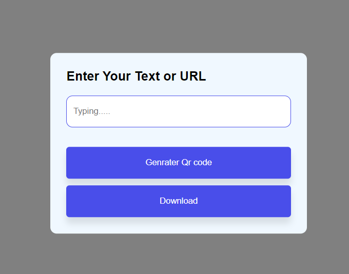

# QR-Code-Maker
#### QR-Code-Maker is a simple QR code generator that allows you to create QR codes from any text or URL. These QR codes can be scanned by any QR code scanner app or device, making it easy to share information in a convenient way.

# Technologies Used
- HTML
- CSS
- JavaScript

# User Interface

# User Interface After Generating QR

